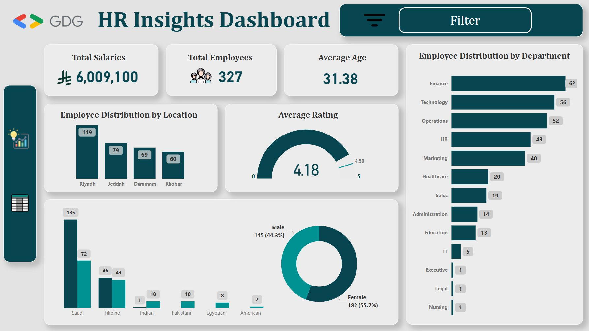

# 📊 HR Insights Dashboard - Data Analysis Project

## 🎯 **Project Overview**

> **🎓 Capstone Project - GDG Data Analysis Bootcamp**  
> Comprehensive HR analytics dashboard analyzing workforce metrics across multiple dimensions

---

## 📈 **Key Performance Indicators**

### 👥 **Employee Analytics**
- **🏢 Total Employees:** 327 across all locations
- **📍 Location Distribution:**
  - 🏙️ Riyadh: 119 employees
  - 🌊 Jeddah: 79 employees  
  - 🏭 Dammam: 69 employees
  - ⚓ Khobar: 60 employees

### 👨‍👩‍👧‍👦 **Demographics**
- **📊 Average Age:** 31.38 years
- **⚖️ Gender Split:**
  - 👩 Female: 182 (55.7%)
  - 👨 Male: 145 (44.3%)

### 🏢 **Department Breakdown**
- 💰 Finance: 62 | 💻 Technology: 56 | ⚙️ Operations: 52
- 👥 HR: 43 | 📱 Marketing: 40 | 🏥 Healthcare: 20
- 💼 Sales: 19 | 📋 Admin: 14 | 🎓 Education: 13

### ⭐ **Performance Metrics**
- **🏆 Average Rating:** 4.18/5.0
- **✨ Performance Excellence** across all departments

---

## 🛠️ **Technical Implementation**

### 📊 **Tools & Technologies Used:**
- **🎯 Microsoft Power BI** - Dashboard development & visualization
- **📈 Microsoft Excel** - Data processing & statistical analysis
- **⚡ DAX (Data Analysis Expressions)** - Advanced calculations & measures
- **🔄 Power Query** - ETL operations & data transformation

### 🎨 **Dashboard Features:**
- **📊 Interactive Visualizations** - Dynamic charts & real-time exploration
- **🔍 Multi-dimensional Analysis** - Cross-functional insights
- **📈 Performance Tracking** - Comprehensive rating system
- **🎛️ Strategic Filtering** - Advanced filter capabilities

### 📋 **Data Visualization Components:**
- 📊 Bar charts for location/department distribution
- 🥧 Pie charts for gender demographics  
- 📏 Gauge charts for performance ratings
- 📱 KPI cards for key metrics display

---

## 💼 **Business Impact & Value**

### 🎯 **Strategic Insights:**
- **👥 Workforce Planning** - Recruitment & training optimization
- **📊 Performance Management** - Employee satisfaction tracking
- **📍 Resource Allocation** - Department & location optimization
- **📈 Strategic Planning** - Data-driven HR policy development

### 📚 **Learning Outcomes:**
- **🔍 Advanced Data Analysis** - HR metrics & analytical techniques
- **🎨 Data Visualization** - Interactive dashboard creation
- **💡 Strategic Decision Making** - Actionable business insights
- **⚙️ Technical Proficiency** - Power BI & Excel mastery

---

## 🏆 **Project Achievements**

### ✅ **Successfully Delivered:**
- 📊 Comprehensive analytics for 327 employees
- 🎯 Real-time performance monitoring system
- 📈 Multi-location workforce analysis
- 💡 Strategic HR decision-making framework

### 🚀 **Technical Excellence:**
- ⚡ Advanced DAX calculations for complex metrics
- 🔄 Automated data refresh & Power Query optimization
- 🎨 Professional dashboard design with intuitive UX
- 📊 Interactive filtering for targeted analysis

---

## 📋 **Project Details**

**🎓 Project Type:** Capstone Project - GDG Data Analysis Bootcamp  
**🏢 Domain:** Human Resources Analytics  
**🛠️ Tools:** Power BI, Excel, DAX, Power Query  
**✅ Status:** Completed Successfully  

---

> **🚀 This project demonstrates advanced HR analytics capabilities and strategic data visualization skills essential for modern workforce management.**
